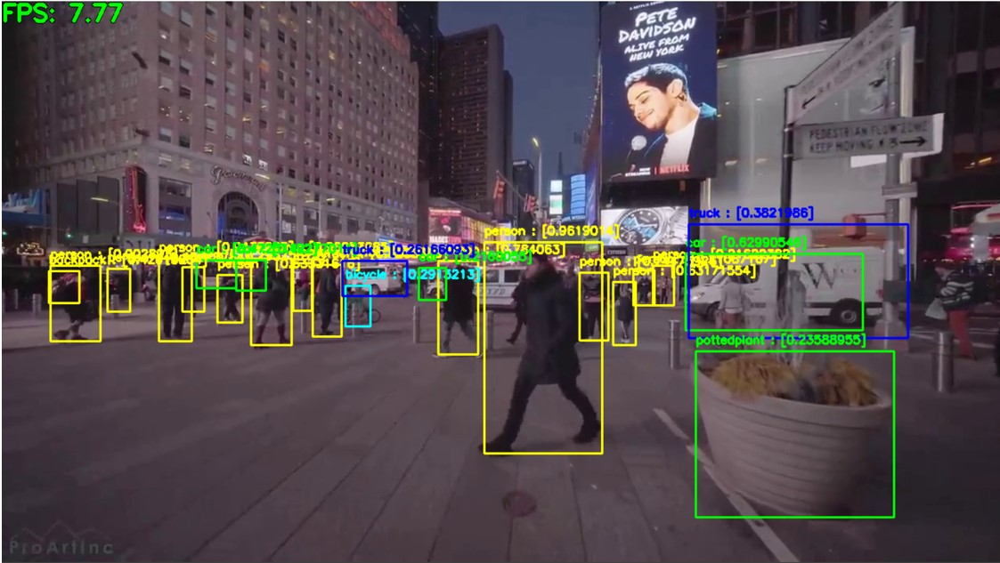

# Image Recognition using YOLOv4

Unlike other object detection algorithms (like R-CNN or Faster R-CNN), it only needs to look at the image once to send it to the neural network.

The neural network architecture is called Darknet.

The files already trained and the file with the classes were downloaded from the repository: https://github.com/AlexeyAB/darknet

